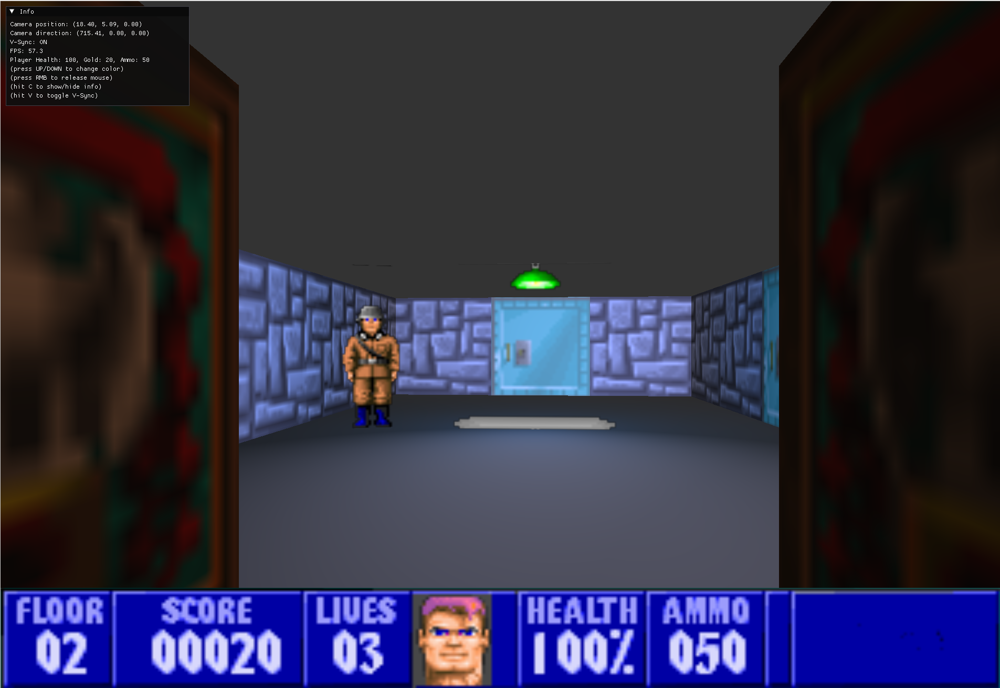

# ICP projekt



## Ovládání

- **WASD** - pohyb
- **Q/E** - rotace kamery
  - pokud je připjená web kamera, tak se hráč otáčí podle pohybu hlavy
- **R** - interakce s objektem (otevření dveří)
- **LMB** - střelba
- **ESC** - ukončení programu

> [!tip]
> Klávesa **F** přepne do fly módu, kde hráč může volně létat po mapě a procházet objekty.

## Instalace závislostí

### Linux

#### Ubuntu
Na čisté instalaci doinstalujte ovladače:
```bash
sudo ubuntu-drivers autoinstall
```

> [!note] 
> Pokud používáte grafickou kartu NVIDIA (například 940MX), nastavte v kódu požadovanou verzi OpenGL na 4.5 nebo nižší:
> ```cpp
> glfwWindowHint(GLFW_CONTEXT_VERSION_MAJOR, 4);
> glfwWindowHint(GLFW_CONTEXT_VERSION_MINOR, 5);
> ```
> Některé ovladače (zejména Mesa) mohou sice v `glxinfo` zobrazit vyšší verzi, ale nativní ovladač NVIDIA podporuje maximálně OpenGL 4.5.

> [!note]
> Pokud vidíte následující chybu při spuštění programu:
> ```bash
> libdecor-gtk-WARNING: Failed to initialize GTK
> Failed to load plugin 'libdecor-gtk.so': failed to init
> No plugins found, falling back on no decorations
> ```
> Tak je čas opustit Wayland a přepnout se na X11. To lze provést v přihlašovací obrazovce, kde vyberete "Ubuntu on Xorg" místo "Ubuntu".


#### GLEW
`apt-dependencies.txt` obsahuje seznam balíčků, které je potřeba nainstalovat pro správný chod programu. 

```txt
libopencv-dev
libglfw3-dev
libglm-dev
libglew-dev
v4l-utils
```

Pro instalaci závislostí spusťte následující příkaz:
```bash
./install.sh
```

Ten také nainstaluje závsilosti `C++` knihoven:
```txt
nlohmann-json
```

### WSL
Pro instalaci závislostí spusťte následující příkaz:
```bash
./install.sh
```

#### GLEW
```bash
sudo apt install -y libopencv-dev libglfw3-dev libglm-dev libglew-dev 
mesa-utils
```

```bash
glxinfo | grep "OpenGL version"
```

`OpenGL version string: 4.6 (Compatibility Profile) Mesa 24.2.8-1ubuntu1~24.04.1`

#### X11
```bash
sudo apt-get install libxi-dev libxinerama-dev
```

#### Změna grafiky na NVIDIA

```bash
export __NV_PRIME_RENDER_OFFLOAD=1
export __GLX_VENDOR_LIBRARY_NAME=nvidia
```

Jednorázové spuštění programu s NVIDIA grafikou:
`__NV_PRIME_RENDER_OFFLOAD=1 __GLX_VENDOR_LIBRARY_NAME=nvidia ./ICP.out`

### Windows

#### Změna grafiky na NVIDIA

`export MESA_D3D12_DEFAULT_ADAPTER_NAME=NVIDIA`

#### ImGUI

To add ImGUI to your project:
1. Create new filter view: RMB on Solution explorer - project -> Add -> New filter
    - imgui 
2. follow: [Getting-Started](https://github.com/ocornut/imgui/wiki/Getting-Started#compilinglinking)
	- add existing items to imgui filter
3. add `$(ProjectDir)/imgui-master` to your Project properties -> VC++ directories -> Include directories
4. see: [imgui_manual](https://pthom.github.io/imgui_manual_online/manual/imgui_manual.html)

## Spuštění programu

Pro spuštění programu je potřeba zdrojoý kód zkompilovat a spustit.

```bash
make run
```

## Tvorba mapy:
Legenda pro tvorbu mapy:
```txt
' ' = empty
. = empty

// malá abeceda
a = barel 1
b = bead
c = corpse 1
d = killed enemy
e = normal enemy (guard)
f = flag
g = gold
h = health 1
i = health 2
j = health 3
k = key
l = life
m = munition
n
o = barel 2
p = player start
q
r = gun 1
s = gun 2
t = table 1
u = table 2
v
w
x
y = chandelier_1
z = chandelier_2
// velká abeceda
A
B = blue wall
C = corpse 4
D = door
E = hidden door
F
G
H = Hans
I = lamp
J
K = knight
L = stove
M = spears
N
O
P = pillar
Q
R
S = stone 1
T = stone 2
U = stone 3
V = wood 2
W = wood 1
X = end level (exit/elevator)
Y = wood 3
Z
```

## TODO:
- [TODO.md](./TODO.md)

## Zdroje:
Textury a snipety kódu jsou převzaty z následujících zdrojů:
- [Fable Wolfenstein](https://github.com/JamesRandall/fsharp-wolfenstein)
- [Wolfenstein 3D Re-implementation in C++](https://github.com/mhamzaqayyum/wolf3d-reimpl-cpp)
- [Wolfenstein 3D C++](https://github.com/LeviMooreDev/Wolfenstein-3D-CPlusPlus)